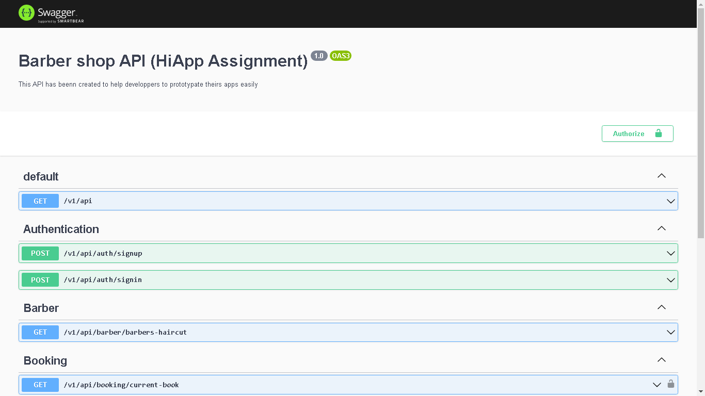
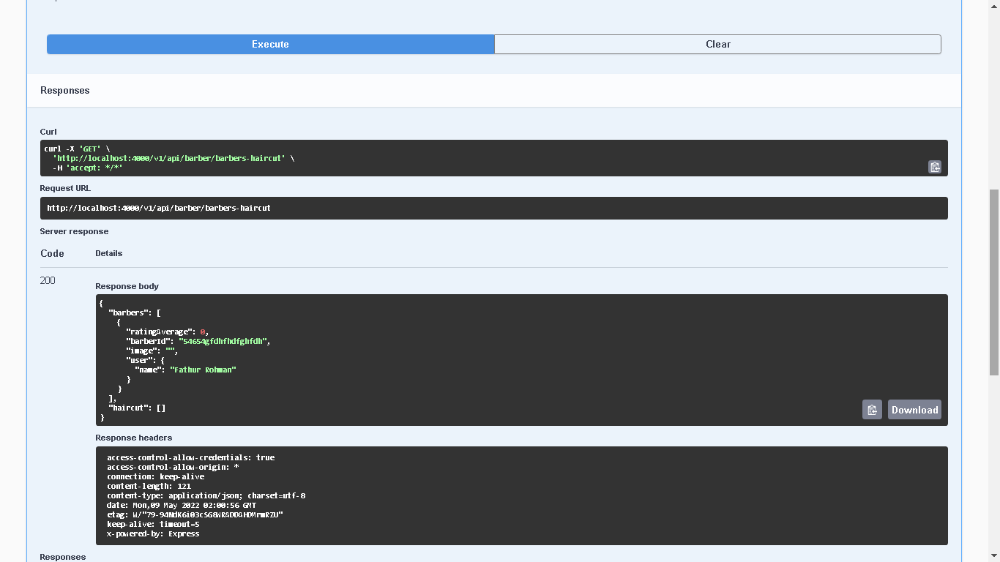
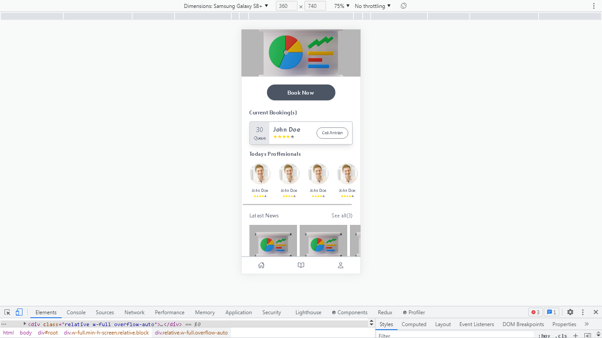
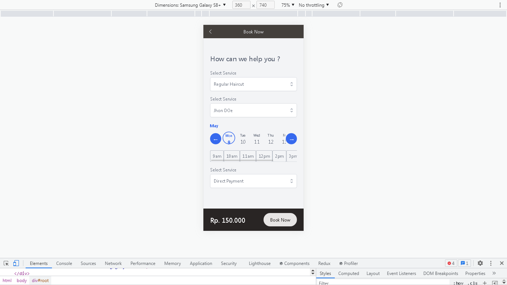

# Barber Shop Application

## Feature Application

### - Authentication user, LOGIN/REGISTER using jsonwebtoken
### - Booking Feature
### - Swagger for documentation

## Usage

### PWA app

After downloading the repository then install the package with `npm install` then `run start`. Port will running on http://localhost:3000

## Server app

After downloading the repository then install the package with `npm install` then `run start:dev`. Port will running on http://localhost:4000
